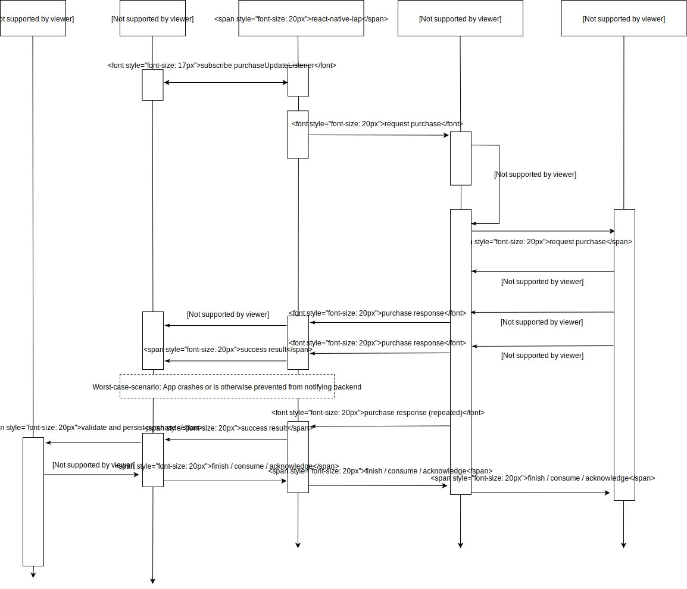

================
[](https://npmjs.org/package/react-native-iap)
[](https://npmjs.org/package/react-native-iap)
[](https://npmjs.org/package/react-native-iap)
[](https://travis-ci.com/dooboolab/react-native-iap)
[](https://github.com/dooboolab/react-native-iap)
[](https://opencollective.com/react-native-iap#backers)
[](https://github.com/dooboolab/react-native-iap/issues)
[](https://github.com/dooboolab/react-native-iap/issues?q=is%3Aissue+is%3Aclosed)
[](https://github.com/dooboolab/react-native-iap/pulls)
[](https://github.com/dooboolab/react-native-iap/pulls?q=is%3Apr+is%3Aclosed) [](https://greenkeeper.io/)

This react-native module will help you access the In-app purchases capabilities of your phone on the `Android`, `iOS` platforms and the `Amazon` platform (Beta).

**Keep in mind** `react-native-iap` will provide the basic features you need but is not a turnkey solution, implementing In-app purchases in your app will still require quite some work.<br/>
Also, implementing the client side is only one side of the coin, you'll have to implement the server side to validate your receipts (which is probably the most time consuming part to do it correctly).

If you're looking for a module going further than react-native-iap, we recommend using [react-native-iaphub](https://github.com/iaphub/react-native-iaphub) which is taking care of everything from the client side to the server side.

⚠️ Most of users experiencing issues are caused by:
  - A device simulator, use a real device for testing!
  - The sandbox environment of the project not being configured properly ([Configure android sandbox](https://www.iaphub.com/docs/set-up-ios/configure-sandbox-testing/), [Configure ios sandbox](https://www.iaphub.com/docs/set-up-ios/configure-sandbox-testing/))
  - An incorrect usage of the library


Demo
----------
>
> 

<!-- Inline anchors -->
[a-acknowledge-purchase-android]: #finishing-a-purchase
[a-migration-guide]: #migration-guide
[a-purchase-flow]: #new-purchase-flow

<!-- Official Blog -->
[blog-config-steps]: https://medium.com/p/121622d26b67
[blog-v3-note]: https://medium.com/p/1259e0b0c017

<!-- Internals -->
[contribute]: https://github.com/dooboolab/react-native-iap/blob/master/CONTRIBUTING.md
[example]: https://github.com/dooboolab/react-native-iap/tree/master/IapExample
[issue-126-c1]: https://github.com/dooboolab/react-native-iap/issues/126#issuecomment-439084872
[issue-174]: https://github.com/dooboolab/react-native-iap/issues/174
[issue-203]: https://github.com/dooboolab/react-native-iap/issues/203
[issue-237]: https://github.com/dooboolab/react-native-iap/issues/237
[issue-256]: https://github.com/dooboolab/react-native-iap/issues/256
[issue-263]: https://github.com/dooboolab/react-native-iap/issues/263
[issue-283]: https://github.com/dooboolab/react-native-iap/issues/283
[issue-307-c1]: https://github.com/dooboolab/react-native-iap/issues/307#issuecomment-447745027
[issue-307]: https://github.com/dooboolab/react-native-iap/issues/307
[open-collective-backer]: https://opencollective.com/react-native-iap#backer
[open-collective-sponsor]: https://opencollective.com/react-native-iap#sponsor
[open-collective]: https://opencollective.com/react-native-iap
[readme-deprecated]: https://github.com/dooboolab/react-native-iap/blob/master/README_DEPRECATED.md

<!-- Externals -->
[android-acknowledge-purchase]: https://developer.android.com/reference/com/android/billingclient/api/BillingClient.html#acknowledgePurchase(com.android.billingclient.api.AcknowledgePurchaseParams,%20com.android.billingclient.api.AcknowledgePurchaseResponseListener) "BillingClient#acknowledgePurchase()"
[android-end-connection]: https://developer.android.com/reference/com/android/billingclient/api/BillingClient.html#endConnection() "BillingClient#endConnection()"
[android-iap-validation-guide]: https://developer.android.com/google/play/billing/billing_library_overview
[android-migrate-androidx]: https://developer.android.com/jetpack/androidx/migrate
[android-sku-details]: https://developer.android.com/reference/com/android/billingclient/api/SkuDetails
[apple-iap-promoting]: https://developer.apple.com/app-store/promoting-in-app-purchases/
[apple-iap-validation-guide]: https://developer.apple.com/library/content/releasenotes/General/ValidateAppStoreReceipt/Chapters/ValidateRemotely.html
[apple-store-kit-flow]: https://forums.developer.apple.com/thread/6431#14831
[google-api-nodejs-client]: https://github.com/googleapis/google-api-nodejs-client/
[google-play-console]: https://play.google.com/apps/publish/
[stackoverflow-android-iap-validation]: https://stackoverflow.com/questions/35127086
[android-access-token-example-repo]: https://github.com/Bang9/android-get-access-token-example

Quick News
----------
- We had hard time supporting `react-native-iap` issues that did not provide working codes or any other examples. Therefore, we've decided to make an `example` app called [DoobooIAP](https://github.com/hyochan/DoobooIAP), which will contain all the features of `IAP`'s and willing to continuously improve to support real-life examples. [@Bang9](http://github.com/bang9) who had been helping many others for `react-native-iap`, is willing to support this repo so he will grant $300 of our income in `opencollective` as described in [#855](https://github.com/dooboolab/react-native-iap/issues/855) :tada:.
- `react-native-iap@4.0.8` ~ `react-native-iap@4.1.0` is incompatible with `react-native <0.61`. This is fixed in `react-native-iap@4.1.1` and above.
- `react-native-iap@4.0.0` has been released. You can see [#716](https://github.com/dooboolab/react-native-iap/pull/716) for updates.
- ~~For early stages, You can install pre-releases version by running `npm install --save reqct-native-iap@next`~~
  - `next` package isn't maintained currently. This will be re-opened when there is breaking change comming to support `iap`.
- In the past, `react-native-iap@^3.*` has been updated very prompty for migration issues.
    Don't get suprised too much on why it is bumping up version so quickly these days.
  1. Migrated to new `AndroidX` APIs.
  2. Migrated to new `Android` billing client which is `> 2.0.0`.
     - [`acknowledgePurchase()`][android-acknowledge-purchase] has been added since `3.2.0` which is very important.
  3. New [Purchase Flow][a-purchase-flow]
  4. More is comming in `iOS 13`.

Breaking Changes
----------------
- Migrated to AndroidX in `3.1.0`. Please check the [Migration Guide][a-migration-guide].
- Recommended to use `3.2.0` or above for `react-native-iap@^3.0.0` users.
  - Now, you should [acknowledge purchase][a-acknowledge-purchase-android]
      with non-consumable and subscription purchase from `3.0.0`.
      See more about [acknowledgePurchase][android-acknowledge-purchase].
  - If you are using version `^3.0.* < ^3.1.0`, please use `acknowledgePurchase` supported in `3.0.3`.
      You can use method like `androidpublisher.purchases.subscriptions.acknowledge`.
- `3.4.0` introduces a similar flow to consumable purchases on iOS. You should update your code according to the recommended flow and pass `false` to `andDangerouslyFinishTransactionAutomatically` when calling`requestPurchase`.

Configuration of Google Play & iTunes Connect
---------------------------------------------
- Please refer to [Blog][blog-config-steps].

[Deprecated README][readme-deprecated]
--------------------------------------
- If you are using `react-native-iap@^2.*`, please follow the above README.

News on Major Releases
----------------------
- [react-native-iap V3 note][blog-v3-note]

#### Methods

Method                                                                                 | Result                    | Description
------                                                                                 | ------                    | -----------
`initConnection()`                                                                     | `Promise<boolean>`        | Init IAP module.<br>On Android this can be called to preload the connection to Play Services.<br>On iOS, it will simply call `canMakePayments` method and return value which is required for the listeners to work properly.
`purchaseUpdatedListener((purchase: ProductPurchase) => {})`                           | `EmitterSubscription`　　　| Register a callback that gets called when the store has any updates to purchases that have not yet been finished, consumed or acknowledged. Returns a React Native `EmitterSubscription` on which you can call `.remove()` to stop receiving updates. Register you listener as soon as possible and react to updates at all times.
`purchaseErrorListener((error: PurchaseError) => {})`                                  | `EmitterSubscription`　　　| Register a callback that gets called when there has been an error with a purchase. Returns a React Native `EmitterSubscription` on which you can call `.remove()` to stop receiving updates.
`getProducts(skus: string[])`<ul><li>skus: array of Product ID/sku</li></ul>           | `Promise<Product[]>`      | Get a list of products (consumable and non-consumable items, but not subscriptions).<br>Note: With before `iOS 11.2`, this method _will_ also return subscriptions if they are included in your list of SKUs. This is because we cannot differentiate between IAP products and subscriptions prior to `iOS 11.2`.
`getSubscriptions(skus: string[])`<ul><li>skus: array of Subscription ID/sku</li></ul> | `Promise<Subscription[]>` | Get a list of subscriptions.<br>Note: With before `iOS 11.2`, this method _will_ also return products if they are included in your list of SKUs. This is because we cannot differentiate between IAP products and subscriptions prior to `iOS 11.2`.
`getPurchaseHistory()`                                                                 | `Promise<Purchase>`       | Gets an inventory of purchases made by the user regardless of consumption status (where possible).
`getAvailablePurchases()`                                                              | `Promise<Purchase[]>`     | Get all purchases made by the user (either non-consumable, or haven't been consumed yet). On Android, it can be called at app launch, but on iOS, only at restoring purchase is recommended (See: [#747](https://github.com/dooboolab/react-native-iap/issues/747)).
`requestPurchase(sku: string, andDangerouslyFinishTransactionAutomatically: boolean, obfuscatedAccountIdAndroid: string, obfuscatedProfileIdAndroid: string)`<ul></ul>                    | `Promise<ProductPurchase>`       | Request a purchase.<br>`purchaseUpdatedListener` will receive the result.<br/> `andDangerouslyFinishTransactionAutomatically` defaults to `true` for backwards compatibility but this is deprecated and you should set it to false once you're [manually finishing your transactions][a-purchase-flow].
`requestPurchaseWithQuantityIOS(sku: string, quantity: number)`<ul><li>sku: product ID/sku</li><li>quantity: Quantity</li></ul>                 | `void` | **iOS only**<br>Buy a product with a specified quantity.<br>`purchaseUpdatedListener` will receive the result
_*deprecated_<br>~~`buySubscription(sku: string)`~~<ul><li>sku: subscription ID/sku</li></ul> | `void` | Create (buy) a subscription to a sku.
`requestSubscription(sku: string, andDangerouslyFinishTransactionAutomaticallyIOS: boolean, oldSkuAndroid: string, purchaseTokenAndroid: string, prorationModeAndroid: string, obfuscatedAccountIdAndroid: string, obfuscatedProfileIdAndroid: string)`<ul><li>sku: subscription ID/sku</li></ul>                  | `void`   | Create (buy) a subscription to a sku.
`clearTransactionIOS()` | `void`            | **iOS only**<br>Clear up unfinished transanctions which sometimes cause problems. Read more in [#257](https://github.com/dooboolab/react-native-iap/issues/257), [#801](https://github.com/dooboolab/react-native-iap/issues/801).
`clearProductsIOS()`    | `void`            | **iOS only**<br>Clear all products and subscriptions.<br>Read more in below README.
`getReceiptIOS()`   | `Promise<string>` | **iOS only**<br>Get the current receipt.
`getPendingPurchasesIOS()` | `Promise<ProductPurchase[]>` | **IOS only**<br>Gets all the transactions which are pending to be finished.
`validateReceiptIos(body: Record<string, unknown>, devMode: boolean)`<ul><li>body: receiptBody</li><li>devMode: isTest</li></ul> | `Object\|boolean` | **iOS only**<br>Validate receipt.
`endConnection()` | `Promise<void>` | End billing connection.
`consumeAllItemsAndroid()` | `Promise<void>` | **Android only**<br>Consume all items so they are able to buy again. ⚠️ Use in dev only (as you should deliver the purchased feature BEFORE consuming it)
`flushFailedPurchasesCachedAsPendingAndroid()` | `Promise<void>` | **Android only**<br>Consume all 'ghost' purchases (that is, pending payment that already failed but is still marked as pending in Play Store cache)
`consumePurchaseAndroid(token: string, payload?: string)`<ul><li>token: purchase token</li><li>payload: developerPayload</li></ul>     | `void` | **Android only**<br>Finish a purchase. All purchases should be finished once you have delivered the purchased items. E.g. by recording the purchase in your database or on your server.
`acknowledgePurchaseAndroid(token: string, payload?: string)`<ul><li>token: purchase token</li><li>payload: developerPayload</li></ul> | `Promise<PurchaseResult>` | **Android only**<br>Acknowledge a product. Like above for non-consumables. Use `finishTransaction` instead for both platforms since version 4.1.0 or later.
`consumePurchaseAndroid(token: string, payload?: string)`<ul><li>token: purchase token</li><li>payload: developerPayload</li></ul>     | `Promise<PurchaseResult>` | **Android only**<br>Consume a product. Like above for consumables. Use `finishTransaction` instead for both platforms since version 4.1.0 or later.
`finishTransactionIOS(transactionId: string)`<ul><li>transactionId: the transactionId that you would like to finish.</li></ul> | `Promise<void>` | **iOS only**<br>Finish a transaction. Use `finishTransaction` instead for both platforms since version 4.1.0 or later.
`finishTransaction(purchase: InAppPurchase/ProductPurchase, isConsumable?: boolean, developerPayloadAndroid?: string)`<ul><li>purchase: purchase object</li><li>isConsumable?: specify whether the product is a consumable</li><li>developerPayloadAndroid: developerPayload</li></ul> | `Promise<void>` | This method works for both platforms and is recommended since version 4.1.0 or later. Equal to `finishTransactionIOS` + `consumePurchaseAndroid` and `acknowledgePurchaseAndroid`.
_*deprecated_<br>~~`buySubscription(sku: string, prevSku?: string, mode?: number)`~~<ul><li>sku: subscription ID/sku</li><li>prevSku: old subscription ID/sku (optional)</li><li>mode: proration mode (optional)</li></ul> | `Promise<Purchase>` | **Android only**<br>Create (buy) a subscription to a sku.<br>For upgrading/downgrading subscription on Android pass the second parameter with current subscription ID, on iOS this is handled automatically by store.<br>You can also optionally pass in a proration mode integer for upgrading/downgrading subscriptions on Android
`validateReceiptAndroid(bundleId: string, productId: string, productToken: string, accessToken: string)`<br><ul><li>bundleId: the packageName</li><li>productId: productId</li><li>productToken: productToken</li><li>accessToken: accessToken</li><li>isSubscription: isSubscription</li></ul> | `Object\|boolean` | **Android only**<br>Validate receipt.


</details>

Npm Module
----------
https://www.npmjs.com/package/react-native-iap

Git Repo
--------
https://github.com/dooboolab/react-native-iap

Getting Started
---------------
`$ npm install --save react-native-iap`

### Mostly automatic installation

#### Using React Native >= 0.60
Linking the package manually is not required anymore with [Autolinking](https://github.com/react-native-community/cli/blob/master/docs/autolinking.md).

- **iOS Platform:**

  `$ cd ios && pod install && cd ..` # CocoaPods on iOS needs this extra step

- **Android Platform with Android Support:**

  Using [Jetifier tool](https://github.com/mikehardy/jetifier) for backward-compatibility.

  Modify your **android/build.gradle** configuration:
  ```
  buildscript {
    ext {
      buildToolsVersion = "28.0.3"
      minSdkVersion = 16
      compileSdkVersion = 28
      targetSdkVersion = 28
      # Only using Android Support libraries
      supportLibVersion = "28.0.0"
    }
  ```

- **Android Platform with AndroidX:**

  Modify your **android/build.gradle** configuration:
  ```
  buildscript {
    ext {
      buildToolsVersion = "28.0.3"
      minSdkVersion = 16
      compileSdkVersion = 28
      targetSdkVersion = 28
      # Remove 'supportLibVersion' property and put specific versions for AndroidX libraries
      androidXAnnotation = "1.1.0"
      androidXBrowser = "1.0.0"
      // Put here other AndroidX dependencies
    }
  ```

#### Using React Native < 0.60

`$ react-native link react-native-iap`

### Manual installation

#### iOS
1. In XCode, in the project navigator, right click `Libraries` ➜ `Add Files to [your project's name]`
2. Go to `node_modules` ➜ `react-native-iap` and add `RNIap.xcodeproj`
3. In XCode, in the project navigator, select your project. Add `libRNIap.a` to your project's `Build Phases` ➜ `Link Binary With Libraries`
4. Run your project (`Cmd+R`)<

#### iOS with Podfile
1. Open up `ios/Podfile`
  - Add `pod 'RNIap', :path => '../node_modules/react-native-iap'`
2. Run `pod install`

#### Android

1. Open up `android/app/src/main/java/[...]/MainApplication.java`
    - Add `import com.dooboolab.RNIap.RNIapPackage;` to the imports at the top of the file
    - Add `new RNIapPackage()` to the list returned by the `getPackages()` method
2. Append the following lines to `android/settings.gradle`:
    ```gradle
    include ':react-native-iap'
    project(':react-native-iap').projectDir = new File(rootProject.projectDir, '../node_modules/react-native-iap/android')
    ```
3. Insert the following lines inside the dependencies block in `android/app/build.gradle`:
    ```gradle
    compile project(':react-native-iap')
    ```
4. Update ProGuard config (Optional)
  - Append the following lines to your ProGuard config (`proguard-rules.pro`)
    ```
    -keepattributes *Annotation*
    -keepclassmembers class ** {
      @org.greenrobot.eventbus.Subscribe <methods>;
    }
    -keep enum org.greenrobot.eventbus.ThreadMode { *; }
    ```
5. Add the following to the `<permission>` block in `android/app/src/main/AndroidManifest.xml`:
  ```xml
  <uses-permission android:name="com.android.vending.BILLING" />
  ```

### Migrating to 3.4.0

- Upgrade to the new [purchase flow][a-purchase-flow].
- There is no longer any need to call endConnection on Android as this is done automatically.

Usage
-----
You can look in the [`RNIapExample/`][example] folder to try the example.
Below is basic implementation which is also provided in `RNIapExample` project.

Init IAP, In App Billing
------------------------
First thing you should do is to define your items for iOS and Android
separately like defined below.
```javascript
import * as RNIap from 'react-native-iap';

const itemSkus = Platform.select({
  ios: [
    'com.example.coins100'
  ],
  android: [
    'com.example.coins100'
  ]
});
```

Get Valid Items
---------------
To get a list of valid items, call `getProducts()`.

You can do it in `componentDidMount()`, or another area as appropriate for you app.

Since a user may first start your app with a bad internet connection, then later
have an internet connection, making preparing/getting items more than once may
be a good idea.

Like if the user has no IAPs available when the app first starts, you may want
to check again when the user enters your IAP store.

```javascript
  async componentDidMount() {
    try {
      const products: Product[] = await RNIap.getProducts(itemSkus);
      this.setState({ products });
    } catch(err) {
      console.warn(err); // standardized err.code and err.message available
    }
  }
```

Each `product` returns from `getProducts()` contains:

#### typeof `Product`
> All the following properties are `String`

Property                                 | iOS | And | Comment
--------                                 | :-: | :-: | -------
`price`                                  | ✓   | ✓   | Localized price string, with only number (eg. `1.99`).
`productId`                              | ✓   | ✓   | Returns a string needed to purchase the item later.
`currency`                               | ✓   | ✓   | Returns the currency code.
`localizedPrice`                         | ✓   | ✓   | Localized price string, with number and currency symbol (eg. `$1.99`).
`title`                                  | ✓   | ✓   | Returns the title Android and localizedTitle on iOS.
`description`                            | ✓   | ✓   | Returns the localized description on Android and iOS.
`introductoryPrice`                      | ✓   | ✓   | Formatted introductory price of a subscription, including its currency sign, such as €3.99.<br>The price doesn't include tax.
`introductoryPricePaymentModeIOS`        | ✓   |     | The payment mode for this product discount.
`introductoryPriceNumberOfPeriods`       | ✓   |     | An integer that indicates the number of periods the product discount is available.
`introductoryPriceNumberOfPeriodsIOS`    | ✓   |     | An integer that indicates the number of periods the product discount is available.
`introductoryPriceSubscriptionPeriod`    | ✓   |     | An object that defines the period for the product discount.
`introductoryPriceSubscriptionPeriodIOS` | ✓   |     | An object that defines the period for the product discount.
`subscriptionPeriodNumberIOS`            | ✓   |     | The period number (in string) of subscription period.
`subscriptionPeriodUnitIOS`              | ✓   |     | The period unit in `DAY`, `WEEK`, `MONTH` or `YEAR`.
`subscriptionPeriodAndroid`              |     | ✓   | Subscription period, specified in ISO 8601 format.<br>For example, P1W equates to one week, P1M equates to one month, P3M equates to three months, P6M equates to six months, and P1Y equates to one year.
`introductoryPriceCyclesAndroid`         |     | ✓   | The number of subscription billing periods for which the user will be given the introductory price, such as 3.
`introductoryPricePeriodAndroid`         |     | ✓   | The billing period of the introductory price, specified in ISO 8601 format.
`freeTrialPeriodAndroid`                 |     | ✓   | Trial period configured in Google Play Console, specified in ISO 8601 format. For example, P7D equates to seven days.

Purchase
--------
> The flow of the `purchase` has been renewed by the founding in issue [#307][issue-307].
> I've decided to redesign the `Purchase Flow` to not rely on `Promise` or `Callback`.
> There are some reasons not to approach in this way:

1. There may be more than one response when requesting a payment.
2. Purchases are inter-session `asynchronuous` meaning requests that are made may take several hours
   to complete and continue to exist even after the app has been closed or crashed.
3. The purchase may be pending and hard to track what has been done ([example][issue-307-c1]).
4. Thus the Billing Flow is an `event` pattern rather than a `callback` pattern.

Once you have called `getProducts()`, and you have a valid response, you can call `requestPurchase()`.
Subscribable products can be purchased just like consumable products and users
can cancel subscriptions by using the iOS System Settings.

Before you request any purchase, you should set `purchaseUpdatedListener` from `react-native-iap`.
It is recommended that you start listening to updates as soon as your application launches. And don't
forget that even at launch you may receive successful purchases that either completed while your app was
closed or that failed to be finished, consumed or acknowledged due to network errors or bugs.

```javascript
import RNIap, {
  purchaseErrorListener,
  purchaseUpdatedListener,
  type ProductPurchase,
  type PurchaseError
} from 'react-native-iap';

class RootComponent extends Component<*> {
  purchaseUpdateSubscription = null
  purchaseErrorSubscription = null

  componentDidMount() {
    RNIap.initConnection().then(() => {
      // we make sure that "ghost" pending payment are removed
      // (ghost = failed pending payment that are still marked as pending in Google's native Vending module cache)
      RNIap.flushFailedPurchasesCachedAsPendingAndroid().catch(() => {
        // exception can happen here if:
        // - there are pending purchases that are still pending (we can't consume a pending purchase)
        // in any case, you might not want to do anything special with the error
      }).then(() => {
        this.purchaseUpdateSubscription = purchaseUpdatedListener((purchase: InAppPurchase | SubscriptionPurchase | ProductPurchase ) => {
          console.log('purchaseUpdatedListener', purchase);
          const receipt = purchase.transactionReceipt;
          if (receipt) {
            yourAPI.deliverOrDownloadFancyInAppPurchase(purchase.transactionReceipt)
            .then( async (deliveryResult) => {
              if (isSuccess(deliveryResult)) {
                // Tell the store that you have delivered what has been paid for.
                // Failure to do this will result in the purchase being refunded on Android and
                // the purchase event will reappear on every relaunch of the app until you succeed
                // in doing the below. It will also be impossible for the user to purchase consumables
                // again until you do this.
                if (Platform.OS === 'ios') {
                  await RNIap.finishTransactionIOS(purchase.transactionId);
                } else if (Platform.OS === 'android') {
                  // If consumable (can be purchased again)
                  await RNIap.consumePurchaseAndroid(purchase.purchaseToken);
                  // If not consumable
                  await RNIap.acknowledgePurchaseAndroid(purchase.purchaseToken);
                }

                // From react-native-iap@4.1.0 you can simplify above `method`. Try to wrap the statement with `try` and `catch` to also grab the `error` message.
                // If consumable (can be purchased again)
                await RNIap.finishTransaction(purchase, true);
                // If not consumable
                await RNIap.finishTransaction(purchase, false);
              } else {
                // Retry / conclude the purchase is fraudulent, etc...
              }
            });
          }
        });

        this.purchaseErrorSubscription = purchaseErrorListener((error: PurchaseError) => {
          console.warn('purchaseErrorListener', error);
        });
      })
    })
  }

  componentWillUnmount() {
    if (this.purchaseUpdateSubscription) {
      this.purchaseUpdateSubscription.remove();
      this.purchaseUpdateSubscription = null;
    }
    if (this.purchaseErrorSubscription) {
      this.purchaseErrorSubscription.remove();
      this.purchaseErrorSubscription = null;
    }
  }
}
```

Then define the method like below and call it when user press the button.

```javascript
  requestPurchase = async (sku: string) => {
    try {
      await RNIap.requestPurchase(sku, false);
    } catch (err) {
      console.warn(err.code, err.message);
    }
  }

  requestSubscription = async (sku: string) => {
    try {
      await RNIap.requestSubscription(sku);
    } catch (err) {
      console.warn(err.code, err.message);
    }
  }

  render() {
    ...
      onPress={() => this.requestPurchase(product.productId)}
    ...
  }
```

New Purchase Flow
-----------------


Most likely, you'll want to handle the “store kit flow”[<sup>\[2\]</sup>][apple-store-kit-flow],
which happens when a user successfully pays after solving a problem with his
or her account – for example, when the credit card information has expired.

For above reason, we decided to remove ~~`buyProduct`~~ and use `requestPurchase` instead which doesn't rely on promise function. The `purchaseUpdatedListener` will receive the success purchase and `purchaseErrorListener` will receive all the failure result that occured during the purchase attempt.

Finishing a Purchase
----------------------
Purchases will keep being emitted to your `purchaseUpdatedListener` on every app relaunch until you finish the purchase.

Consumable purchases should be consumed by calling `consumePurchaseAndroid()` or `finishTransactionIOS()`.
Once an item is consumed, it will be removed from `getAvailablePurchases()` so it is up to you
to record the purchase into your database before calling `consumePurchaseAndroid()` or `finishTransactionIOS()`.

Non-consumable purchases need to be acknowledged on Android, or they will be automatically refunded after 
a few days. Acknowledge a purchase when you have delivered it to your user by calling `acknowledgePurchaseAndroid()`.
On iOS non-consumable purchases are finished automatically but this will change in the future so it is recommended that you prepare by simply calling `finishTransactionIOS()` on non-consumables as well.

`finishTransaction()` works for both platforms and is recommended since version 4.1.0 or later. Equal to finishTransactionIOS + consumePurchaseAndroid and acknowledgePurchaseAndroid.

Restoring Purchases
-----------------------------------
You can use `getAvailablePurchases()` to do what's commonly understood as “restoring” purchases.

If for debugging you want to consume all items, you have to iterate over the purchases
returned by `getAvailablePurchases()`. Beware that if you consume an item without having 
recorded the purchase in your database the user may have paid for something without getting
it delivered and you will have no way to recover the receipt to validate and restore their 
purchase.

```javascript
  getPurchases = async () => {
    try {
      const purchases = await RNIap.getAvailablePurchases();
      const newState = { premium: false, ads: true }
      let restoredTitles = [];

      purchases.forEach(purchase => {
        switch (purchase.productId) {
        case 'com.example.premium':
          newState.premium = true
          restoredTitles.push('Premium Version');
          break

        case 'com.example.no_ads':
          newState.ads = false
          restoredTitles.push('No Ads');
          break

        case 'com.example.coins100':
          await RNIap.consumePurchaseAndroid(purchase.purchaseToken);
          CoinStore.addCoins(100);
        }
      })

      Alert.alert('Restore Successful', 'You successfully restored the following purchases: ' + restoredTitles.join(', '));
    } catch(err) {
      console.warn(err); // standardized err.code and err.message available
      Alert.alert(err.message);
    }
  }
```

Returned purchases is an array of each purchase transaction with the following keys:

#### typeof `AvailablePurchase`

Property                           | Type      | iOS | And | Comment
--------                           | ----      | :-: | :-: | -------
`productId`                        | `string`  | ✓   | ✓   | The product ID for the product.
`transactionReceipt`               | `string`  | ✓   | ✓   | **iOS**: The `receipt`.<br>**Android**: Stringified JSON of the original purchase object.
`transactionId`                    | `string`  | ✓   | ✓   | A unique order identifier for the transaction.
`transactionDate`                  | `number`  | ✓   | ✓   | The time the product was purchased, in milliseconds since the epoch (Jan 1, 1970).
`originalTransactionDateIOS`       | `number`  | ✓   |     | For a transaction that restores a previous transaction, the date of the original transaction.
`originalTransactionIdentifierIOS` | `string`  | ✓   |     | For a transaction that restores a previous transaction, the transaction identifier of the original transaction.
`purchaseToken`                    | `string`  |     | ✓   | A token that uniquely identifies a purchase for a given item and user pair.
`autoRenewingAndroid`              | `boolean` |     | ✓   | Indicates whether the subscription renews automatically.<br>If true, the subscription is active, and will automatically renew on the next billing date. Otherwise, indicates that the user has canceled the subscription.
`dataAndroid`                      | `string`  |     | ✓   | Original json for purchase data.
`signatureAndroid`                 | `string`  |     | ✓   | The signature of the purchase data that was signed with the private key of the developer.<br>The data signature uses the `RSASSA-PKCS1-v1_5` scheme.
`isAcknowledgedAndroid`            | `boolean` |     | ✓   | Checking if purchase has been acknowledged.
`purchaseStateAndroid`             | `number`  |     | ✓   | Indicating purchase state.

You need to test with one sandbox account, because the account holds previous purchase history.

Receipt validation
------------------
Since `react-native-iap@0.3.16`, we support receipt validation.

### With [IAPHUB](https://www.iaphub.com)

IAPHUB is a service that takes care of the ios/android receipt validation for you, you can set up [webhooks](https://dashboard.iaphub.com/documentation/webhook) in order to get notifications delivered automatically to your server on events such as a purchase, a subscription renewal...

You can use it by calling the API manually to [process your receipt](https://dashboard.iaphub.com/documentation/api/post-receipt) or use the [react-native-iaphub](https://github.com/iaphub/react-native-iaphub) module that is just a wrapper of react-native-iap with IAPHUB built-in.

### With Google Play

For Android, you need separate json file from the service account to get the
`access_token` from `google-apis`, therefore it is impossible to implement serverless.

You should have your own backend and get `access_token`.
With `access_token` you can simply call `validateReceiptAndroid()` we implemented.
Further reading is [here][stackoverflow-android-iap-validation] or refer to [example repo][android-access-token-example-repo].

### With App Store

Currently, serverless receipt validation is possible using `validateReceiptIos()`.
- The first parameter, you should pass `transactionReceipt` which returns after `buyProduct()`.
- The second parameter, you should pass whether this is `test` environment.
    If `true`, it will request to `sandbox` and `false` it will request to `production`.

```javascript
  const receiptBody = {
    'receipt-data': purchase.transactionReceipt,
    'password': '******'
  };
  const result = await RNIap.validateReceiptIos(receiptBody, false);
  console.log(result);
```

For further information, please refer to [guide][apple-iap-validation-guide].

Sometimes you will need to get the receipt at times other than after purchase.
For example, when a user needs to ask for permission to buy a product (`Ask to buy`
flow) or unstable internet connections.

For these cases we have a convenience method `getReceiptIOS()` which gets
the latest receipt for the app at any given time. The response is base64 encoded.

### iOS Purchasing process right way.
Issue regarding `valid products`

- In iOS, generally you are fetching valid products at App launching process.

    If you fetch again, or fetch valid subscription, the products are added to
    the array object in iOS side (Objective-C `NSMutableArray`).

    This makes unexpected behavior when you fetch with a part of product lists.

    For example, if you have products of `[A, B, C]`, and you call fetch function
    with only `[A]`, this module returns `[A, B, C]`).

    This is weird, but it works.

- But, weird result is weird, so we made a new method which remove all valid products.

    If you need to clear all products, subscriptions in that array, just call
    `clearProductsIOS()`, and do the fetching job again, and you will receive what
    you expected.

### Example backend (Node.js)

[Here](https://github.com/mifi/in-app-subscription-example) you can find an example backend for idempotent validating of receipts on both iOS/Android and storing and serving subscription state to the client.

Q & A
-----
#### How can a user cancel a subscription in my app?
- For both iOS and Android your users cannot cancel subscriptions inside your app. You need to direct your users to iTunes/the App Store or Google Play.

- You can do this on iOS 12 or later (for earlier iOS versions, use [this URL](https://buy.itunes.apple.com/WebObjects/MZFinance.woa/wa/manageSubscriptions)):
    ```javascript
    Linking.openURL('https://apps.apple.com/account/subscriptions')
    ```

- You can do this on Android:
    ```javascript
    Linking.openURL('https://play.google.com/store/account/subscriptions?package=YOUR_PACKAGE_NAME&sku=YOUR_PRODUCT_ID
    ```
    (change `YOUR_PACKAGE_NAME` and `YOUR_PRODUCT_ID`)

- More on `Linking` in React Native: https://facebook.github.io/react-native/docs/linking


#### Can I buy product right away skipping fetching products if I already know productId?
- You could only in Android in `react-native-iap@^2.*`.

    However, now you should always `fetchProducts` first in both platforms.
    It is because Android `BillingClient` has been updated `billingFlowParams`
    to include [SkuDetails][android-sku-details] instead `sku` string which is
    hard to share between `react-native` and `android`.

    It happened since `com.android.billingclient:billing:2.0.*`.

    Therefore we've planned to store items to be fetched in Android before
    requesting purchase from `react-native` side, and you should always fetch
    list of items to “purchase” before requesting purchase.

  - Related [blog](https://medium.com/p/e4b55491479b).
  - Related issue [#283][issue-283].

#### How do I validate receipt in iOS?
- Official doc is [here][apple-iap-validation-guide].
- Resolved issues in [#203][issue-203], [#237][issue-237].

#### How do I validate receipt in Android?
- Offical doc is [here][android-iap-validation-guide].
- I've developed this feature for other developers to contribute easily who are
    aware of these things. The doc says you can also get the `accessToken` via
    play console without any of your backend server.

    You can get this by following process:
  - Open [Google Play Console][google-play-console]
      &gt; Select your app
      &gt; Development tools
      &gt; Services & APIs
      &gt; Find in “Your license key for this application”.
      [reference](https://stackoverflow.com/questions/27132443).

#### How to make consumable product in Android developer mode?
- If you are facing `"You already own this item"` on developer(test) mode,
    you might check related issue [#126][issue-126-c1]

#### How do I use `react-native-iap` in Expo?
- You should detach from `expo` and get `expokit` out of it.
- Releated issue in [#174][issue-174].

#### How do I handle promoted products in iOS?
- Offical doc is [here][apple-iap-promoting].
- No initial setup needed from `4.4.5`.
- Add an EventListener for the `iap-promoted-product` event somewhere early in your app's lifecycle:

  ```javascript
  import { NativeModules, NativeEventEmitter } from 'react-native'
  const { RNIapIos } = NativeModules;
  const IAPEmitter = new NativeEventEmitter(RNIapIos);

  IAPEmitter.addListener('iap-promoted-product', async () => {
    // Check if there's a persisted promoted product
    const productId = await RNIap.getPromotedProductIOS();
    if (productId !== null) { // You may want to validate the product ID against your own SKUs
      try {
        await RNIap.buyPromotedProductIOS(); // This will trigger the App Store purchase process
      } catch(error) {
        console.warn(error);
      }
    }
  });
  ```

#### Invalid productId in iOS.
- Please try below and make sure you've done the steps:

    1. Completed an effective "Agreements, Tax, and Banking."
    2. Setup sandbox testing account in "Users and Roles."
    3. Signed into iOS device with sandbox account in "Settings / iTunes & App Stores".
    3. Set up three In-App Purchases with the following status:
        - Ready to Submit
        - Missing Metadata
        - Waiting for Review
    4. Enable "In-App Purchase" in Xcode "Capabilities" and in Apple Developer -> "App ID" setting.
    5. Clean up builds:
        - Delete the app on device
        - Restart device
        - Quit “store” related processes in Activity Monitor
        - Development Provisioning Profile -> Clean -> Build.

- Related issues [#256][issue-256] , [#263][issue-263].

#### Module is not working as expected. Throws error.
- The `react-native link` script isn't perfect and sometimes broke.
    Please try `unlink` and `link` again, or try manual install.

#### `getAvailablePurchases()` returns empty array.
- `getAvailablePurchases()` is used only when you purchase a non-consumable
    product. This can be restored only.

    If you want to find out if a user subscribes the product, you should check
    the receipt which you should store in your own database.

    Apple suggests you handle this in your own backend to do things like what
    you are trying to achieve.

#### Using Face ID & Touch to checkout on iOS
- After you have completed the setup and set your deployment target to `iOS 12`,
    FaceID and Touch to purchase will be activated by default in production.

    Please note that in development or TestFlight, it will **NOT** use FaceID/Touch
    to checkout because they are using the Sandbox environment.

Supporting react-native-iap
---------------------------
`react-native` is an open source project with MIT license. We are willing to
maintain this repository to support devs to monetize around the world.

Since `IAP` itself is not perfect on each platform, we desperately need
this project to be maintained. If you'd like to help us, please consider being
with us in [Open Collective][open-collective].

### Sponsors
Support this project by becoming a sponsor. Your logo will show up here with
a link to your website. \[[Become a sponsor][open-collective-sponsor]\]

### Backers
Please be our [Backers][open-collective-backer].
<a href="https://opencollective.com/react-native-iap#backers" target="_blank"></a>

### Contributing
Please make sure to read the [Contributing Guide][contribute] before making a pull request.
Thank you to all the people who helped to maintain and upgrade this project!

<a href="graphs/contributors"></a>
<hr>
