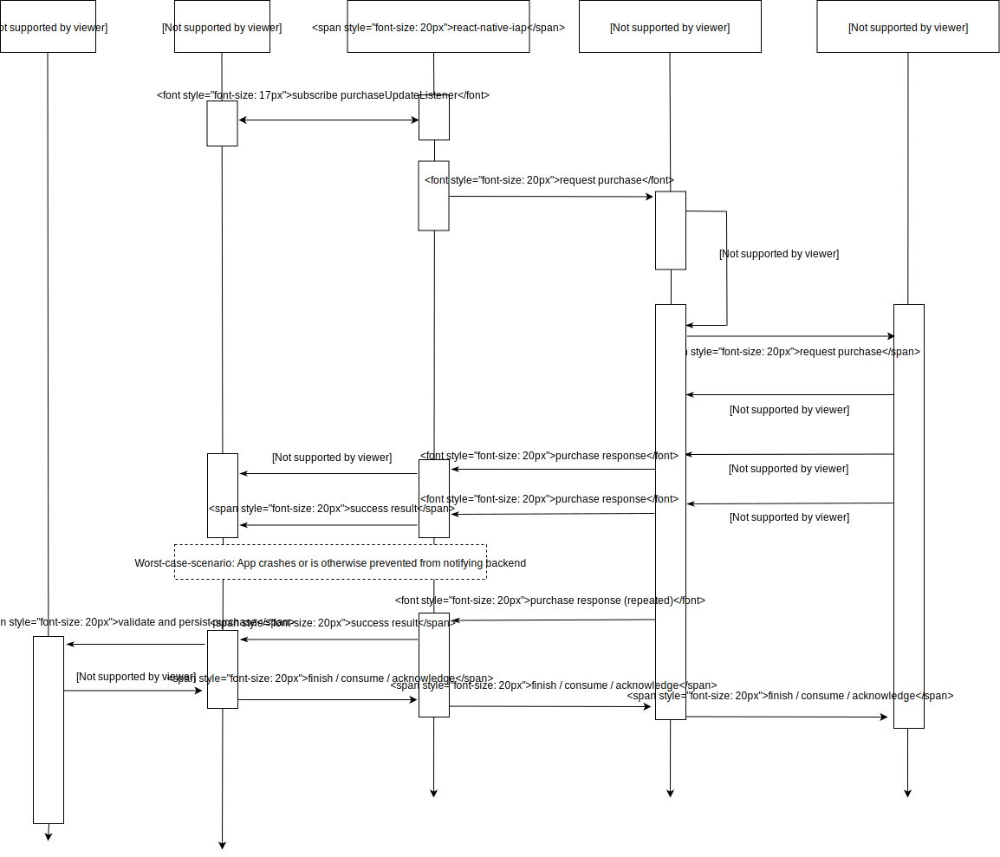

# Making a purchase

> :warning: **Purchase Flow Redesign** :warning:
> 
> The `purchase` flow has been updated as a result of the findings in issue [#307](https://github.com/dooboolab/react-native-iap/issues/307).
> The resulting flow has been redesign to not rely on `Promise` or `Callback`.
>
> Below are some of the specific reasons for the redesign:
> 
> 1. There may be more than one response when requesting a payment.
> 2. Purchases are inter-session `asynchronuous` meaning requests that are made may take several hours to complete and continue to exist even after the app has been closed or crashed.
> 3. The purchase may be pending and hard to track what has been done ([example](https://github.com/dooboolab/react-native-iap/issues/307).
> 4. The Billing Flow is an `event` pattern rather than a `callback` pattern.

Once you have called `getProducts()`, and have a valid response, you can call `requestPurchase()`. Subscribable products can be purchased just like consumable products and users can cancel subscriptions by using the iOS System Settings.

Before you request any purchase, you should set `purchaseUpdatedListener` from `react-native-iap`. It is recommended that you start listening to updates as soon as your application launches. And don't forget that even at launch you may receive successful purchases that either completed while your app was closed or that failed to be finished, consumed or acknowledged due to network errors or bugs.

```javascript
import RNIap, {
  purchaseErrorListener,
  purchaseUpdatedListener,
  type ProductPurchase,
  type PurchaseError
} from 'react-native-iap';

class RootComponent extends Component<*> {
  purchaseUpdateSubscription = null
  purchaseErrorSubscription = null

  componentDidMount() {
    RNIap.initConnection().then(() => {
      // we make sure that "ghost" pending payment are removed
      // (ghost = failed pending payment that are still marked as pending in Google's native Vending module cache)
      RNIap.flushFailedPurchasesCachedAsPendingAndroid().catch(() => {
        // exception can happen here if:
        // - there are pending purchases that are still pending (we can't consume a pending purchase)
        // in any case, you might not want to do anything special with the error
      }).then(() => {
        this.purchaseUpdateSubscription = purchaseUpdatedListener((purchase: InAppPurchase | SubscriptionPurchase | ProductPurchase ) => {
          console.log('purchaseUpdatedListener', purchase);
          const receipt = purchase.transactionReceipt;
          if (receipt) {
            yourAPI.deliverOrDownloadFancyInAppPurchase(purchase.transactionReceipt)
            .then( async (deliveryResult) => {
              if (isSuccess(deliveryResult)) {
                // Tell the store that you have delivered what has been paid for.
                // Failure to do this will result in the purchase being refunded on Android and
                // the purchase event will reappear on every relaunch of the app until you succeed
                // in doing the below. It will also be impossible for the user to purchase consumables
                // again until you do this.
                await RNIap.finishTransaction(purchase);

                // From react-native-iap@4.1.0 you can simplify above `method`. Try to wrap the statement with `try` and `catch` to also grab the `error` message.
                // If consumable (can be purchased again)
                await RNIap.finishTransaction(purchase, true);
                // If not consumable
                await RNIap.finishTransaction(purchase, false);
              } else {
                // Retry / conclude the purchase is fraudulent, etc...
              }
            });
          }
        });

        this.purchaseErrorSubscription = purchaseErrorListener((error: PurchaseError) => {
          console.warn('purchaseErrorListener', error);
        });
      })
    })
  }

  componentWillUnmount() {
    if (this.purchaseUpdateSubscription) {
      this.purchaseUpdateSubscription.remove();
      this.purchaseUpdateSubscription = null;
    }
    if (this.purchaseErrorSubscription) {
      this.purchaseErrorSubscription.remove();
      this.purchaseErrorSubscription = null;
    }
  }
}
```

Then define the method like below and call it when user press the button.

```javascript
  requestPurchase = async (sku: string) => {
    try {
      await RNIap.requestPurchase({ sku, andDangerouslyFinishTransactionAutomaticallyIOS: false });
    } catch (err) {
      console.warn(err.code, err.message);
    }
  }

  requestSubscription = async (sku: string) => {
    try {
      await RNIap.requestSubscription({sku});
    } catch (err) {
      console.warn(err.code, err.message);
    }
  }

  render() {
    ...
      onPress={() => this.requestPurchase(product.productId)}
    ...
  }
```

New Purchase Flow
-----------------


Most likely, you'll want to handle the “store kit flow”[<sup>\[2\]</sup>][apple-store-kit-flow],
which happens when a user successfully pays after solving a problem with his or her account – for example, when the credit card information has expired.

For above reason, we decided to remove ~~`buyProduct`~~ and use `requestPurchase` instead which doesn't rely on promise function. The `purchaseUpdatedListener` will receive the success purchase and `purchaseErrorListener` will receive all the failure result that occurred during the purchase attempt.

Finishing a Purchase
----------------------
Purchases will keep being emitted to your `purchaseUpdatedListener` on every app relaunch until you finish the purchase.

All purchases should be consumed by calling  `finishTransaction()`. 
- For consumables: Once an item is consumed, it will be removed from `getAvailablePurchases()` so it is up to you to record the purchase into your database before calling  `finishTransaction()`.
- For non-consumable purchases need to be acknowledged on Android, or they will be automatically refunded after a few days. This method acknowledges a purchase when you have delivered it to your user.
- On iOS non-consumable purchases are finished automatically but this will change in the future so it is recommended that you prepare by simply calling this method on non-consumables as well.
- It works for both platforms. Equal to finishTransaction for iOS + consumePurchase and acknowledgePurchase for Android.
